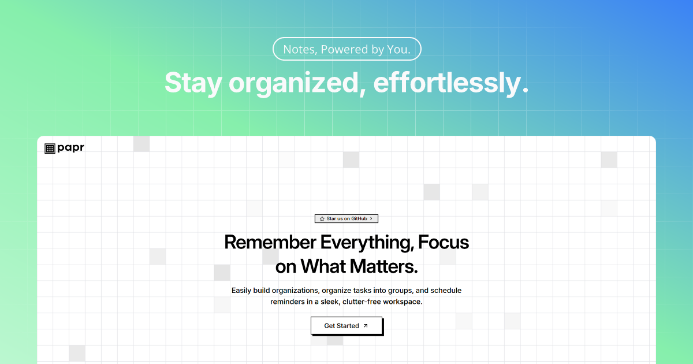

<div align="center">
  
</div>

<br />

<div align="center">


</div>

<h1 align="center">Papr – Remember Everything, Focus on What Matters.</h1>

<p align="center">Effortlessly build and manage organizations, categorize tasks into structured groups, assign responsibilities, and schedule timely reminders—all within a sleek, intuitive, and clutter-free workspace designed to boost productivity and focus.</p>

---

## 🚀 Getting Started

1. Clone or [**fork**](https://github.com/i-mkarmakar/papr) the repo:

```bash
git clone git@github.com:i-mkarmakar/papr.git
````

2. Move into the project directory:

```bash
cd papr
```

3. Install dependencies:

```bash
npm install -g pnpm
pnpm install
```

4. Copy `.env.example` to `.env` and fill in the variables:

```bash
cp .env.example .env
```

5. Push the schema:

```bash
pnpm db push
```

6. Start the dev server:

```bash
pnpm dev
```

---

## 🛠️ Stack

This project is built with the [**T3 Stack**](https://create.t3.gg) and uses the following technologies:

* [Next.js](https://nextjs.org/) – The React framework for production.
* [Tailwind CSS](https://tailwindcss.com/) – A utility-first CSS framework for rapid UI development.
* [shadcn/ui](https://ui.shadcn.com/) – A set of components built with Tailwind CSS and Radix UI.
* [Clerk](https://clerk.dev/) – Authentication and user management.
* [Drizzle](https://orm.drizzle.team/) – TypeScript ORM for PostgreSQL.
* [PostgreSQL](https://www.postgresql.org/) – The world's most advanced open source relational database.
* [Tanstack Query](https://tanstack.com/query/v4) – A powerful data-fetching library for React.
* [Zod](https://zod.dev/) – A TypeScript-first schema declaration and validation library.

---

## 🤝 Contributing

Found a bug or have a feature idea?
You're welcome to contribute:

* 🍴 Fork the repo
* 🌱 Create a new branch
* 🔁 Open a pull request

Every bit of help is appreciated! 🙌
